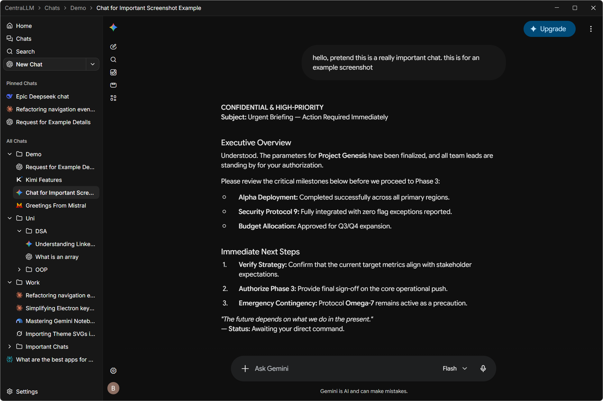

<div align="center">
  
  <p><b>The centralised desktop workspace for all your web-based LLMs.</b></p>
  <p>
    <a href="https://github.com/Break-Ben/centrallm/releases/latest"><b>⬇️ Download</b></a> &nbsp;•&nbsp;
    <a href="https://centrallm.com"><b>🌐 Website</b></a> &nbsp;•&nbsp; 
    <a href="https://ko-fi.com/Break_Ben"><b>☕ Support on Ko-fi</b></a>
  </p>
  <br />
  
</div>

---

## Features

- **Universal Access:** Manage multiple web-based LLMs in one native desktop app.
- **Unified Sidebar:** Organise chats across providers into customisable drag-and-drop folders.
- **Pinned Chats:** Fast access to your most frequently used conversations.
- **Browser Convenience:** Stay logged in to your accounts, keep open tabs, and maintain native web interface functionality.
- **Custom Chat Providers:** Add custom web-based LLM providers alongside many built-in options.
- **Global Shortcuts & Search:** Quick navigation, search capabilities, and customisable keybindings.
- **Clean, Modern UI:** Fully customisable dark/light theme with sidebar resizing and tray integration.

---

## Getting Started

### Prerequisites

- [Node.js](https://nodejs.org/) (v20+)
- `npm`

### Installation & Development

```bash
git clone https://github.com/Break-Ben/centrallm.git
cd centrallm
npm install
npm run dev
```

### Building

```bash
# Windows (Officially supported)
npm run build:win

# macOS & Linux
npm run build:mac
npm run build:linux

# Unpackaged directory
npm run build:unpack
```

---

## Known Issues

This app is a work-in-progress, and some of the current known issues include:

- **Webview UI Overlap:** The web view overlaps some UI elements such as right-click context menus.
- **Chat Names:** Chat names are currently only shown if their providers include the chat name in the site title (most major providers do).
- **Platform Support:** Official support is currently only provided for Windows. Linux likely works, but macOS will encounter issues.

---

## Contributing & Security

- Read [CONTRIBUTING.md](CONTRIBUTING.md) for development rules and PR guidelines.
- Read [SECURITY.md](SECURITY.md) for data privacy details and vulnerability reporting.

---

## License

Licensed under [AGPL-3.0-only](LICENSE).
